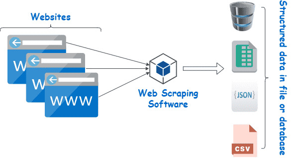
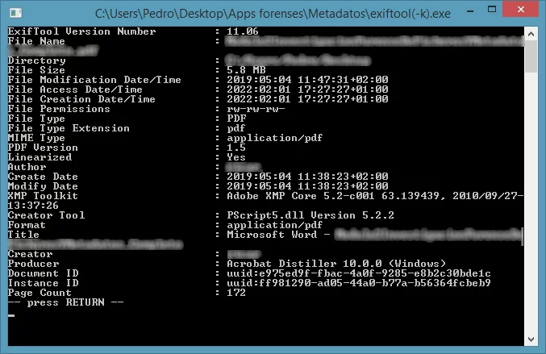
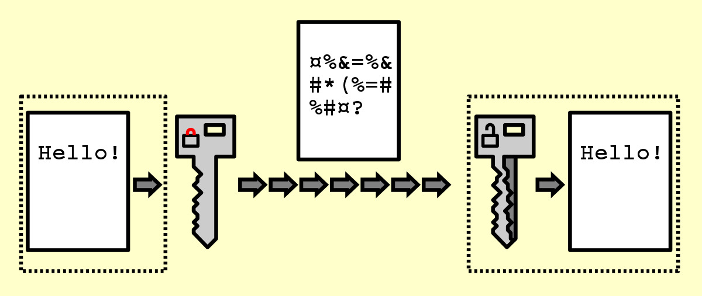
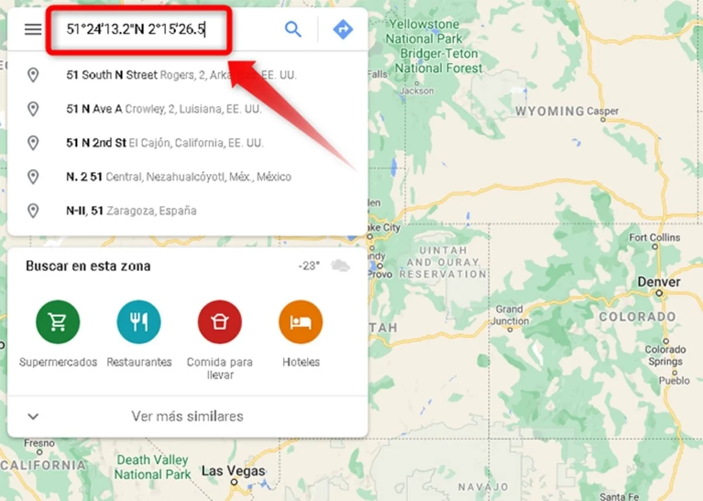
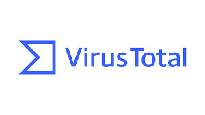

**CypherScan**
*********************
Nuestra Suite de Programación de Ciberseguridad(CypherScan) es una herramienta muy poderosa que brinda a los usuarios las capacidades necesarias para proteger sus sistemas y datos en el entorno digital en constante evolución de hoy en día, está diseñada para abordar una variedad de aspectos relacionados con la seguridad en línea. Desde la recopilación de datos hasta la protección contra amenazas, esta suite proporciona una amplia gama de funcionalidades para ayudar a los usuarios a mantener la seguridad y la integridad de sus sistemas y datos en el ciberespacio.

**Características Principales**
==================================
- **Web Scraping**
Puede extraer información relevante de páginas web(en este caso imágenes y pdfs) de manera automatizada, facilitando la obtención de datos para su análisis posterior.

- **Obtención de Metadatos**
Permite acceder a los metadatos de imágenes, lo que nos proporciona información valiosa como su origen(que más adelante usamos), autoría, contenido, etc.

- **Cifrado de Mensajes**
Esta función va de la mano con la obtención de metadatos, ya que para garantizar la confidencialidad de la comunicación, ciframos los metadatos obtenidos anteriormente.

- **Escaneo de Puertos**
Permite identificar la ip y los puertos abiertos de una página web.

- **Análisis de Vulnerabilidades**
Con ayuda de la función de escaneo de puertos, esta herramienta permite evaluar la seguridad de páginas web en busca de posibles vulnerabilidades que podrían ser explotadas por atacantes.

- **Búsqueda de coordenadas**
A partir de los metadatos obtenemos las coordenadas que queremos ubicar en el mapa para una mejor comprensión de la información obtenida(se hace una búsqueda de ubicaciones en Google Maps)

- **Integración con VirusTotal**
Por último pero no menos importante, mencionaremos que nuestra suite utiliza la API de VirusTotal para verificar la seguridad de los URLS obtenidos durante el web scraping, para identificar posibles amenazas.

**Beneficios**
==================
La combinación de estas herramientas proporciona una solución integral para abordar diversos aspectos de la ciberseguridad; de igual manera podemos hablar que la suite automatiza tareas que son algo repetitivas y complejas, permitiendo a nuestros usuarios realizar análisis de seguridad de manera eficiente y efectiva, por lo tanto, los usuarios pueden adaptar y personalizar las herramientas según sus necesidades específicas, lo que les permite abordar desafíos únicos en el ámbito de la ciberseguridad.
En resumen, se puede decir que al identificar y abordar vulnerabilidades potenciales, la suite ayuda a mejorar la postura de la seguridad de sistemas y datos en línea.